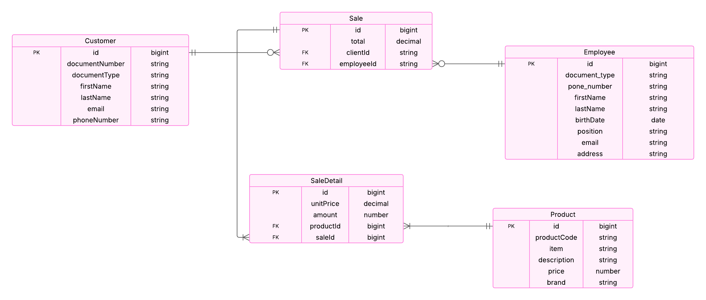

# Aplicacion Web Springboot - Postgres

## Problema planteado:

Una compañía que se dedica a la venta de motocicletas necesita llevar a cabo la
implementación de un sistema de información que tiene como finalidad gestionar 
los procesos de dicha compañía, la información que se maneja es la siguiente:

A. Producto: ítem que puede ser una motocicleta o un insumo para la misma. (código, item,
descripción, precio, marca, entre otros que considere necesarios)
B. Un cliente puede comprar uno o varios productos en una misma operación.
C. En la venta deberán registrarse los productos, la información del cliente y del vendedor.
D. De un empleado se tiene la información: tipo de documento de identidad, número de
identidad, nombres, apellidos, fecha de nacimiento, cargo, email, celular, dirección.

Los puntos a realizar y entregar son los siguientes:
1. (ENTREGABLE) Se debe realizar el modelo E-R de la base de datos teniendo en cuenta las
   entidades, atributos, relaciones entre ellas y conceptos de normalización.
2. (PRESENTACIÓN) Realizar una pequeña aplicación Java Web para la manipulación de la
   información presentada con anterioridad. La aplicación debe permitir realizar el CRUD para
   los registros de las tablas de la base de datos. (Ventas, como la más importante)
3. (ENTREGABLE) Presentar las siguientes consultas SQL:

   a. Obtener los cinco (5) productos más vendidos. La información que se debe
   mostrar es: nombre del producto, marca y cantidad de ventas.

   b. Obtener la cantidad de productos de la marca “Suzuki” que vendió cada empleado.
   La información que se debe mostrar es: nombre del empleado, suma de productos
   vendidos, suma de dinero de los productos vendidos.

## MER

A continuación se presenta el Modelo Entidad-Relación (MER) diseñado para dar solución al problema planteado.

Se definieron entidades para representar al producto (Product), al cliente (Customer) y al empleado (Employee).

Además, se creó una entidad (Sale) para modelar las ventas del sistema, donde cada venta está asociada a un único cliente y un único empleado.

Cada venta puede incluir uno o más detalles de venta (SaleDetail), los cuales están vinculados a un único producto.
Esta estructura permite registrar múltiples productos en una sola venta si se requiere.




## Correr la aplicacion

### Tecnologias a utilizar

- JDK 21v (Necesario que este instalado)
- SpringBoot (En las dependencias del proyecto)
- Maven (Lo contiene el proyecto de SpringBoot)
- Docker (Necesario que este instalado)
- Docker Compose (Necesario que este instalado)
- PostgreSQL (Correra en Contenedor Docker)
- Postman (Necesario que este instalado)

A continuacion creamos la base de datos usando docker y docker compose a partir de un archivo yaml que esta en la raiz del proyecto

### Crear y levantar el contenedor de la base de datos postgres
``````
cd Motorcycle
docker compose up -d
``````

Ahora levantaremos la API de SpringBoot con Maven

### Correr springboot
``````
./mvnw spring-boot:run
``````
# Antes de probar la API

### Insertar los datos iniciales
``````
cd Motorcycle

psql -h localhost -p 5432 -U admin -d postgres -f ./PruebaTecnicaMotocicletas/src/main/resources/data.sql
``````

## Endpoints

Los Endpoints se pueden encontrar y ejecutar en el postman brindado como un archivo json en la raiz del proyecto

Motocicletas.postman_collection.json

## Consultas SQL

Entraremos en el contenedor donde se ejecuta PostgreSQL con el siguiente comando

### Entrar en el contenedor de PostgreSQL

``````
psql -h localhost -U admin -d postgres
``````
### Usar la base de datos que usa la API
``````
\c postgres
``````
### Mostrar las tablas
``````
\dt
``````

### Para las consultas solicitadas ejecutar los siguientes comandos

Obtener los cinco (5) productos más vendidos. La información que se debe
mostrar es: nombre del producto, marca y cantidad de ventas.

``````
SELECT 
    p.item AS nombre_producto,
    p.brand AS marca,
    SUM(sd.amount) AS cantidad_vendida
FROM sale_detail sd
JOIN products p ON sd.product_id = p.id
GROUP BY p.item, p.brand
ORDER BY cantidad_vendida DESC
LIMIT 5;
``````
Obtener la cantidad de productos de la marca “Suzuki” que vendió cada empleado.
La información que se debe mostrar es: nombre del empleado, suma de productos
vendidos, suma de dinero de los productos vendidos.
``````
SELECT 
    CONCAT(e.first_name, ' ', e.last_name) AS nombre_empleado,
    SUM(sd.amount) AS productos_vendidos,
    SUM(sd.amount * p.price) AS total_vendido
FROM sale s
JOIN employee e ON s.employee_id = e.id
JOIN sale_detail sd ON sd.sale_id = s.id
JOIN products p ON sd.product_id = p.id
WHERE p.brand = 'Suzuki'
GROUP BY e.id, e.first_name, e.last_name;
``````